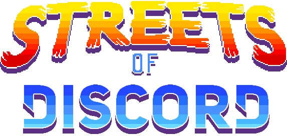
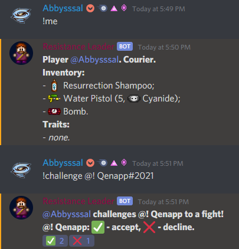
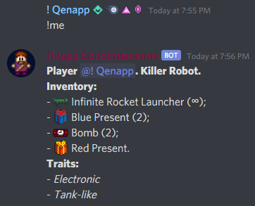

  

    
  

  

    
    
  

# Streets of Discord #
Streets of Rogue role-playing game in Discord.

## How to contribute? ##

#### Ideas, suggestions, interface design ####

Post them in the official Streets of Rogue Discord server (#general) and don't forget to ping me (Abbysssal#2020): 
https://discord.com/invite/streetsofrogue

You can experiment with Discord embeds here: 
https://discord.club/embedg 
or here: 
https://leovoel.github.io/embed-visualizer

#### Code ####

Clone this repository, make some changes, and then create a pull request. If you don't know how to do that, google it.

**Here's what we need help with right now:**
- **Status effect classes**. `Tick()` method will be called every virtual second. You can find all info on status effects in `StatusEffects` class. Examples: `StatusEffects/Regeneration.cs`, `StatusEffects/Poison.cs`.

You can look at other source files to make sure that you have everything needed in yours.

## Screenshots ##

Visual prototypes of some commands:

